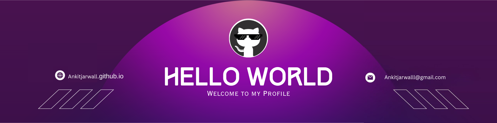

<!--Banner-->

<!--Night Owl image-->

  

<!--Header Name-->
#  ɪ'ᴍ Ankit! 
*Digital Craftsman (Developer / Programmer)*
  

<!--Start Intro-->               

I am a DevOps Engineer with a passion for cloud platforms like AWS, GCP, and Azure, with AWS being my favorite. 

- ✨ Student of life :)
- 🌱 I’m currently learning many things, I believe that everyday is a learning opportunity.
- ❤ Contributing to Open Source.
- 💻 Visit my <a href="https://ankitjarwall.github.io/Ankit/" target="_blank">Portfolio</a> for more details about me.

<!--End Intro-->

<!--Profile Count Badge-->

  
Visitor Count

  

<!--Dynamic Quote card updates everyday at 12 PM--> 
<h2 align="center">🌟 Tʜᴏᴜɢʜᴛ ᴏғ ᴛʜᴇ Dᴀʏ 🌟</h2>

<!--STARTS_HERE_QUOTE_CARD-->

    

<!--ENDS_HERE_QUOTE_CARD-->

<!--Contact Section--> 

<h2 align="center">🤝 Cᴏɴɴᴇᴄᴛ Wɪᴛʜ Mᴇ 🤝 </h2>

  

 

<!--Buy me a coffee-->

<!--Footer--> 

  

           
